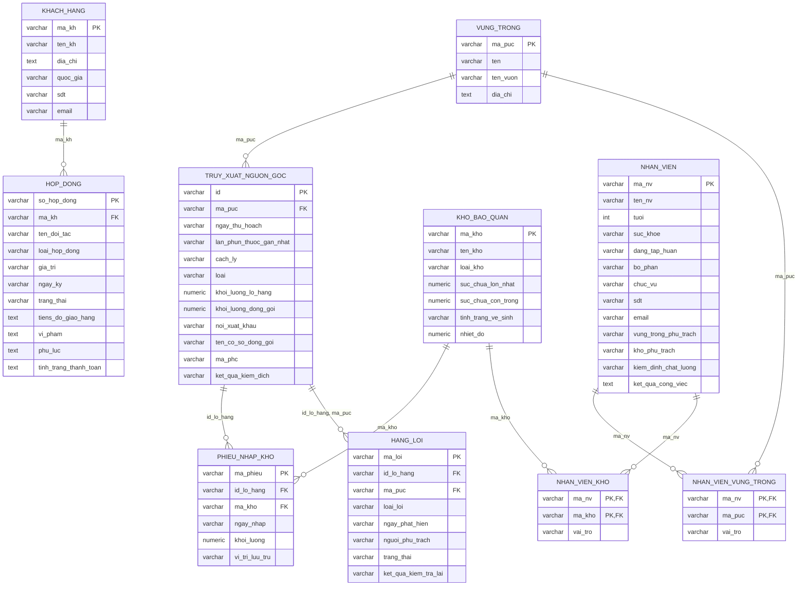

# ERD

```mermaid
erDiagram
    KHACH_HANG ||--o{ HOP_DONG : "ma_kh"

    VUNG_TRONG ||--o{ TRUY_XUAT_NGUON_GOC : "ma_puc"
    TRUY_XUAT_NGUON_GOC ||--o{ PHIEU_NHAP_KHO : "id_lo_hang"
    KHO_BAO_QUAN ||--o{ PHIEU_NHAP_KHO : "ma_kho"

    TRUY_XUAT_NGUON_GOC ||--o{ HANG_LOI : "id_lo_hang, ma_puc"

    NHAN_VIEN ||--o{ NHAN_VIEN_VUNG_TRONG : "ma_nv"
    VUNG_TRONG ||--o{ NHAN_VIEN_VUNG_TRONG : "ma_puc"
    NHAN_VIEN ||--o{ NHAN_VIEN_KHO : "ma_nv"
    KHO_BAO_QUAN ||--o{ NHAN_VIEN_KHO : "ma_kho"

    KHACH_HANG {
        varchar ma_kh PK
        varchar ten_kh
        text dia_chi
        varchar quoc_gia
        varchar sdt
        varchar email
    }

    HOP_DONG {
        varchar so_hop_dong PK
        varchar ma_kh FK
        varchar ten_doi_tac
        varchar loai_hop_dong
        varchar gia_tri
        varchar ngay_ky
        varchar trang_thai
        text tiens_do_giao_hang
        text vi_pham
        text phu_luc
        text tinh_trang_thanh_toan
    }

    NHAN_VIEN {
        varchar ma_nv PK
        varchar ten_nv
        int tuoi
        varchar suc_khoe
        varchar dang_tap_huan
        varchar bo_phan
        varchar chuc_vu
        varchar sdt
        varchar email
        varchar vung_trong_phu_trach
        varchar kho_phu_trach
        varchar kiem_dinh_chat_luong
        text ket_qua_cong_viec
    }

    VUNG_TRONG {
        varchar ma_puc PK
        varchar ten
        varchar ten_vuon
        text dia_chi
    }

    KHO_BAO_QUAN {
        varchar ma_kho PK
        varchar ten_kho
        varchar loai_kho
        numeric suc_chua_lon_nhat
        numeric suc_chua_con_trong
        varchar tinh_trang_ve_sinh
        numeric nhiet_do
    }

    TRUY_XUAT_NGUON_GOC {
        varchar id PK
        varchar ma_puc FK
        varchar ngay_thu_hoach
        varchar lan_phun_thuoc_gan_nhat
        varchar cach_ly
        varchar loai
        numeric khoi_luong_lo_hang
        numeric khoi_luong_dong_goi
        varchar noi_xuat_khau
        varchar ten_co_so_dong_goi
        varchar ma_phc
        varchar ket_qua_kiem_dich
    }

    PHIEU_NHAP_KHO {
        varchar ma_phieu PK
        varchar id_lo_hang FK
        varchar ma_kho FK
        varchar ngay_nhap
        numeric khoi_luong
        varchar vi_tri_luu_tru
    }

    HANG_LOI {
        varchar ma_loi PK
        varchar id_lo_hang FK
        varchar ma_puc FK
        varchar loai_loi
        varchar ngay_phat_hien
        varchar nguoi_phu_trach
        varchar trang_thai
        varchar ket_qua_kiem_tra_lai
    }

    NHAN_VIEN_VUNG_TRONG {
        varchar ma_nv PK, FK
        varchar ma_puc PK, FK
        varchar vai_tro
    }

    NHAN_VIEN_KHO {
        varchar ma_nv PK, FK
        varchar ma_kho PK, FK
        varchar vai_tro
    }
```
